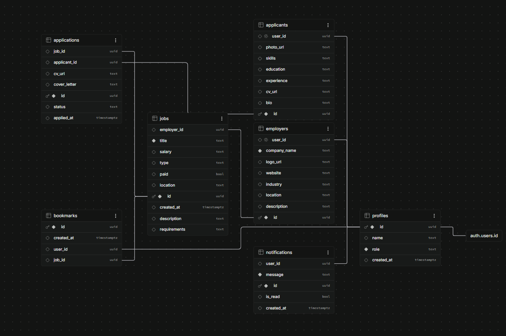
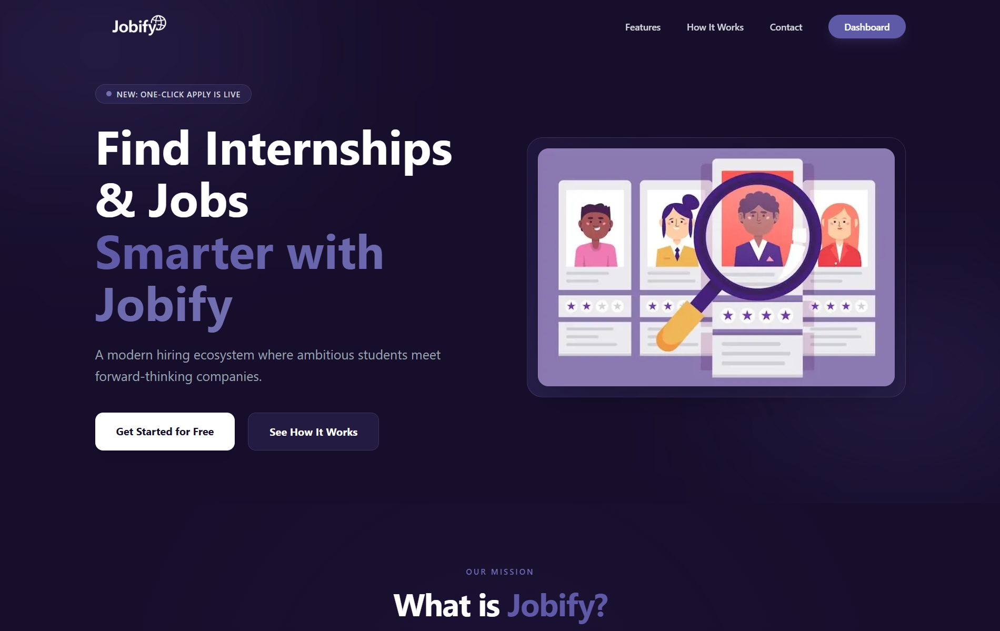
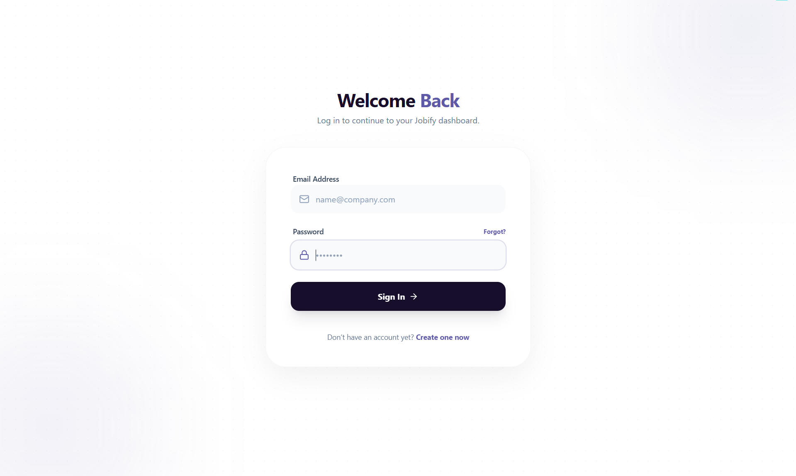
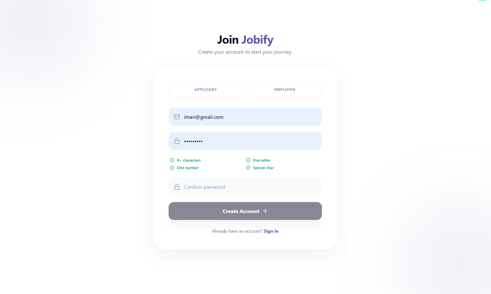
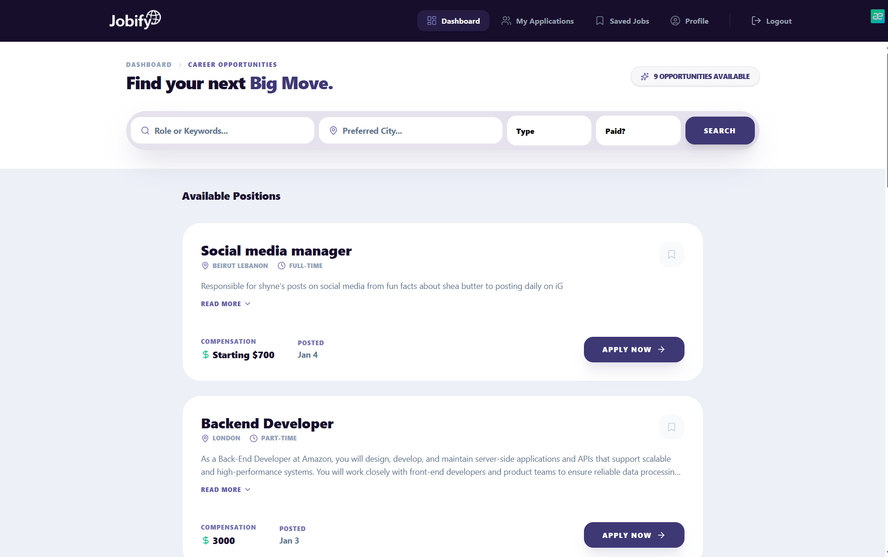

# Jobify – Full-Stack Recruitment Platform

<p align="center">
  
</p>

<p align="center">
  <strong>Connecting job seekers with recruiters through a modern, secure, and user-friendly recruitment platform.</strong>
</p>

<p align="center">
  <a href="https://jobify-bice-five.vercel.app" target="_blank">
    🌐 Live Demo
  </a>
</p>

---

# Overview

Jobify is a full-stack recruitment platform designed to simplify the hiring process for both job seekers and recruiters.

The platform allows job seekers to discover internships and job opportunities, manage applications, upload resumes, and track their application status. Recruiters can publish job openings, manage listings, review applicants, and oversee the hiring process through a dedicated dashboard.

The project was developed collaboratively by a team of five members following the Scrum framework, with project planning and task management conducted using Jira.

---

# Project Objectives

- Simplify the recruitment process.
- Help students and job seekers discover opportunities.
- Provide recruiters with efficient applicant management.
- Maintain platform quality through administrator moderation.
- Deliver a modern, responsive user experience.

---

# Features

## Job Seekers

- Register and log in securely
- OAuth authentication
- Password reset
- Email verification
- Role-based authorization
- Create and edit profile
- Upload CV
- Browse internships and jobs
- Save jobs for later
- Apply for positions
- Track application status

---

## Recruiters

- Company profile management
- Create job postings
- Edit job postings
- Delete job postings
- View applicants
- Review candidate profiles
- Accept or reject applications
- Dashboard analytics

---

## Administrators

- Manage users
- Moderate job posts
- Maintain platform quality

---

# 🛠 Tech Stack

| Category                | Technologies                       |
| ----------------------- | ---------------------------------- |
| Frontend                | Next.js, React                     |
| Styling                 | Tailwind CSS                       |
| Backend                 | Next.js Route Handlers             |
| Authentication          | NextAuth + Supabase Authentication |
| Database                | PostgreSQL (Supabase)              |
| Deployment              | Vercel                             |
| Version Control         | Git & GitHub                       |
| Project Management      | Jira                               |
| Development Methodology | Scrum                              |

---

# System Architecture

The application follows a modern full-stack architecture using Next.js App Router.

```
Client (Browser)
        │
        ▼
Next.js Frontend
        │
        ▼
Next.js Route Handlers
        │
        ▼
NextAuth Authentication
        │
        ▼
Supabase (PostgreSQL + Authentication)
```

---

# User Roles

The platform supports three user roles:

### Job Seeker

- Browse jobs
- Apply for jobs
- Upload CV
- Manage profile
- Track applications

### Recruiter

- Publish job opportunities
- Manage listings
- Review applicants
- Accept or reject applications

### Administrator

- Manage users
- Moderate job postings

---

# Project Structure

```
app/
│
├── admin/
├── api/
├── applicant/
├── applications/
├── bookmarks/
├── employers/
├── jobs-list/
├── login/
├── profile/
└── register/
```

The project follows the Next.js App Router architecture, separating application pages, API route handlers, authentication, and user interfaces into dedicated modules.

---

# Database Design

The database was designed to support multiple user roles and recruitment workflows.

<p align="center">

</p>

---

# Screenshots

## Landing Page



---

## Login



---

## Registration



---

## Job Listings



---

## Recruiter Dashboard


---

## Applicant Tracking


---

## Admin Dashboard


---

# Getting Started

## Prerequisites

- Node.js
- npm
- Git

---

## Installation

Clone the repository.

```bash
git clone https://github.com/janaalabed/techtalks-Jobify-teamD.git
```

Navigate to the project.

```bash
cd techtalks-Jobify-teamD
```

Install dependencies.

```bash
npm install
```

Start the development server.

```bash
npm run dev
```

Open your browser.

```
http://localhost:3000
```

---

# Environment Variables

Create a `.env.local` file in the project root.

Example:

```env
NEXT_PUBLIC_SUPABASE_URL=YOUR_SUPABASE_URL
NEXT_PUBLIC_SUPABASE_ANON_KEY=YOUR_SUPABASE_ANON_KEY

# Add any additional environment variables required by your project.
```

> Do not commit sensitive credentials to the repository.

---

# Team

This project was developed collaboratively by a team of five members as part of a Scrum-based software development project.

---

# Future Improvements

Potential future enhancements include:

- Advanced search filters
- Email notifications
- In-platform messaging
- Company verification
- AI-powered job recommendations
- Interview scheduling
- Resume analysis
- Improved dashboard analytics

---

# License

This project is licensed under the MIT License.

---

# Acknowledgements

This project would not have been possible without the collaboration, dedication, and teamwork of all contributors throughout the development process.
